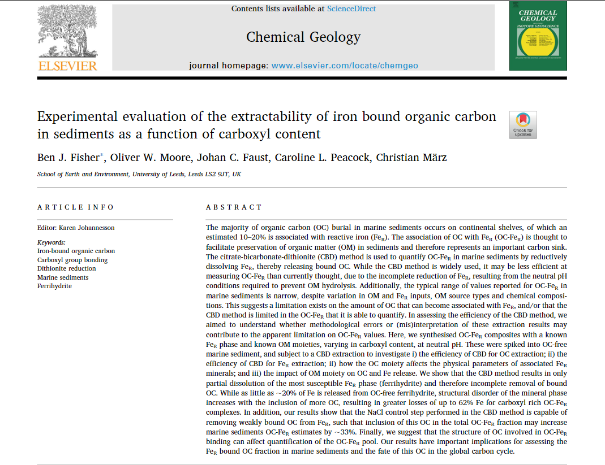

My first first author paper [has been published in Chemical Geology](https://www.sciencedirect.com/science/article/pii/S0009254120303922). This paper was born out of my MSc project at the University of Leeds, experimentally investigating the importance of reactive iron for organic carbon preservation. 

In this paper we show that carboxyl content of organic matter is an important predictor for the extractability of organic carbon from iron. This confirms previous studies which suggested carbon carboxyl- mineral hydroxyl interactions were an important parameter for this association, but go beyond to show that carboxyl content is of growing importance as the number of groups increase. Additionally we also found a flaw in the current method for extracting iron bound carbon, showing inefficiencies of up to 33%. This has serious implications for how we understand results from chemical extractions as changing dynamics in carbon seafloor preservation are likely to be much harder to determine if our tools for doing this have intrinsic inefficiencies. 

A big thanks to my co-authors, funders (NERC, ERC), and the lab staff at the University of Leeds for their help with this paper. 

Fisher, B., Moore, O., Faust, J., Peacock, C. and März, C., 2020. Experimental evaluation of the extractability of iron bound organic carbon in sediments as a function of carboxyl content. *Chemical Geology*, 556, p.119853.

