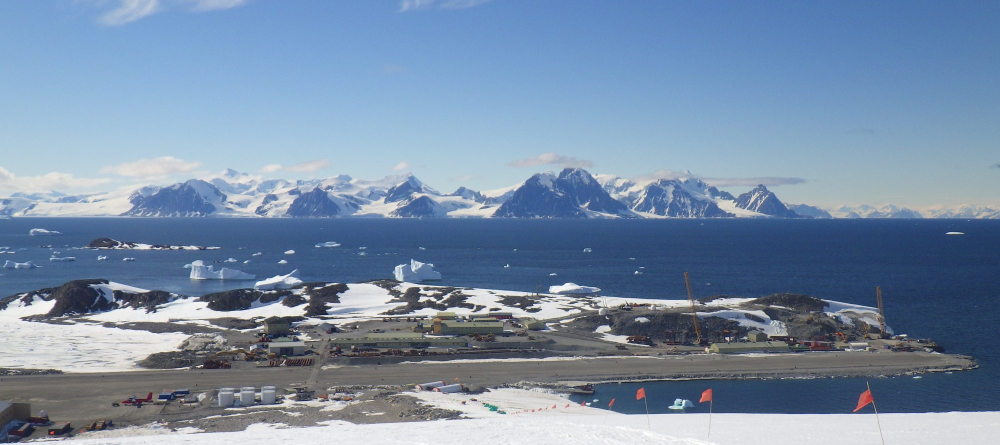

This project is the main focus of my PhD and aims to better understand the climate driven processes influencing phytoplankton community composition and biogeochemistry (C & N cycling) along the west Antarctic Peninsula by creating a data time series over the austral summer. This aims to uncover how variation changes on a seasonal basis compared to the longer decadal scale warming trend. Samples will be obtained during an Antarctic field season in 2021/22 facilitated by project partners BAS, performing phytoplankton species identification alongside C & N uptake experiments.

Collaborators: Scottish Association for Marine Science (SAMS), British Antarctic Survey (BAS). 

*Rothera Research Station, Antarctica where the fieldwork will be stationed. (Credit: pbctoday)*