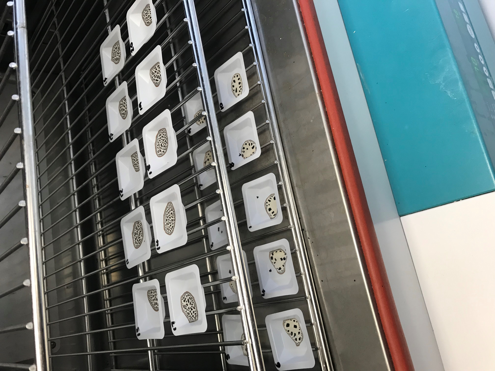
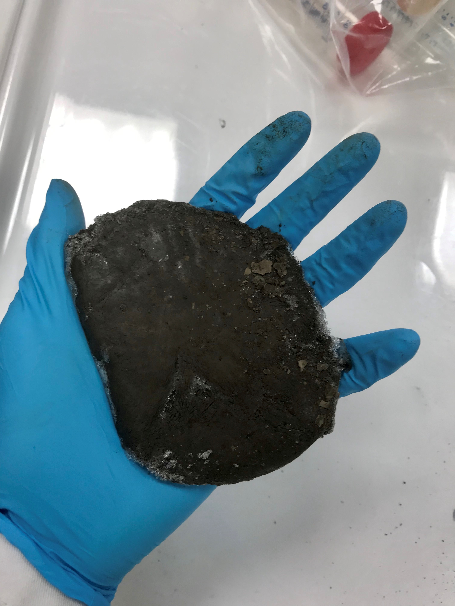
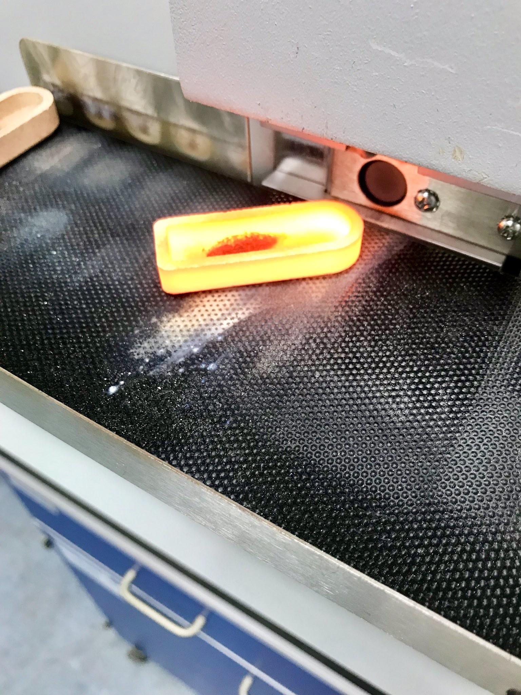

In this project I investigated the role of carboxyl groups in a preservative sorption mechanism of organic carbon to reactive iron phases in marine sediments. This involved using an experimental approach to synthesise organic-ferrihydrite compounds and applying a chemical extraction to these in order to better understand the specificity of this extraction technique for quantifying iron bound carbon. From this study we were able to quantify uncertainties in techniques used to quantify preserved organic carbon on a global scale and suggest improvements to reduce these uncertainties.

This project was supported by grants awards to Changing Arctic Ocean ChAOS, NERC and MinORG, ERC.

### Images

*Drying ferrihydrite coprecipitates for dry mass determination.* 

*A slab of seafloor sediment from the Barents Sea!* 

*Heating samples up to 1500°C for % carbon determination.*